# Guia d'RStudio {#guiarstudio}

Conèixer i dominar els programes de gestió de dades és una habilitat cada vegada més demanada als professionals de la ciència política i les relacions internacionals. I en aquestes branques de les ciències socials, R és el programa més ben situat del mercat per explotar dades de forma estadística. A més, R és gratis. El programa R, no obstant, té un inconvenient important: aprendre a utilitzar-lo és costós quant al temps. És per això que aquesta guia té com a objectiu principal facilitar la instal·lació dels dos programes que necessitarem, R i RStudio, i orientar-nos de forma ràpida en l'ús d'RStudio, el programa que utilitzarem.

Essencialment, R i RStudio són el mateix programa, però **RStudio no pot funcionar sense R**. Podem fer-nos una idea de quina és la funció de cada un d'ells en la figura \@ref(fig:r-motor). El programa R, simbolitzat en la figura de l'esquerra, és el motor. Porta tota la potència perquè puguem fer funcionar la màquina. Però una màquina, per més bona que sigui, no pot funcionar només amb el motor. Necessitem un control de comandament, botons i llumetes que ens permetin utilitzar la màquina d'una forma més intuïtiva i ajudar-nos a treure'n el màxim rendiment. Aquesta és la funció d'RStudio, una carcassa que «muntem» a sobre d'R per poder-lo maniobrar més fàcilment.

```{r r-motor, tidy=FALSE, echo = FALSE, fig.cap="R i Studio | Font: Pixabay, [enllaç imatge1](https://pixabay.com/es/photos/motor-autos-velocidad-automotriz-2828878/) i [enllaç imatge2](https://pixabay.com/es/photos/bentley-coche-lujo-autom%c3%b3vil-1422954/)"}
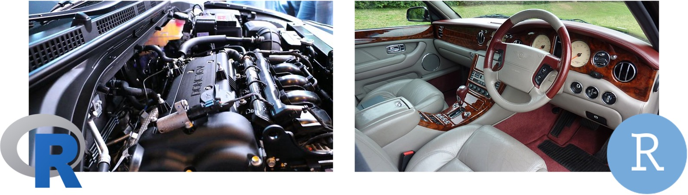
```

Aquest mòdul té com a objectiu ajudar l'estudiant a familiaritzar-se amb l'entorn del programa R. Aquí aprendrem a:

1.1. [**Instal·lar** R i RStudio](#install)  
1.2. [**Navegar** per les finestres d'RStudio](#navigate)  
1.3. [Utilitzar els **paquets** d'R](#packages)  
1.4. [Analitzar el món de **_Star Wars_** amb R](#starwars)  
1.5. [Crear i fer funcionar un *script*](#r-script)  
1.6. [Crear **objectes** d'R](#objects)  
1.7. [**Importar** bases de dades a R](#import-files)  
1.8. [**Repassar** el què hem après](#summary)  

Aquesta guia s'ha actualitzat l'any 2022 i incorpora l'experiència de quatre anys de docència en línia amb R. Això vol dir que moltes de les modificacions respecte a la guia original s'han fet a partir de les experiències, dubtes, preguntes i errors amb els quals s'han trobat estudiants en passades edicions. S'intenta que sigui una guia interactiva, àgil i, sobretot, que l'alumnat guanyi autosuficiència amb l'ús del programa. **És molt important que llegiu tot el text detingudament i no us salteu cap dels passos de la guia**.

<div class="alert alert-info">
**ÚS DE LES CAIXES:** Al llarg de la guia trobareu caixes com aquesta. La idea és que seguiu el text de la caixa i intenteu seguir els passos que s'indiquen. En ocasions us trobareu requadres com el següent, amb codi d'R, que haureu de **copiar i enganxar** (o bé teclejar) a la **consola** o l'**_script_** d'R segons s'indiqui.

```
codi
```
Les caixetes **en verd** són exercicis més aplicats, mentre que a les caixetes **en vermell** hi trobareu errors que us podeu trobar quan intenteu replicar els exercicis que s'indiquen al llarg d'aquest mòdul.
</div>


## Instal·lació{#install}

Per poder utilitzar el programa R, haurem d'instal·lar dos programes al nostre ordinador:

1. El programa [R](#install-r).
2. El programa [RStudio](#install-rstudio). 


### Instal·lació d'R{#install-r}

Per **instal·lar R (1)**, haurem d'anar al repositori [CRAN](https://cran.r-project.org/). Un cop a la pàgina, fixem-nos en la **imatge següent**. Haurem de triar el sistema operatiu que tenim al nostre ordinador:

- Si el sistema operatiu és macOs, a la pàgina següent haurem de buscar un arxiu .pkg per descarregar.
- Si és Windows, haurem de prémer el text ‘Install R for the first time'.
-	En el cas de tenir altres sistemes operatius, el procediment és molt semblant als anteriors.

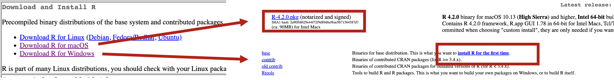{width=95%}

També ens pot ajudar [aquest tutorial d'instal·lació d'R](https://learnr-examples.shinyapps.io/ex-setup-r/#section-install-r). 


### Instal·lació d'RStudio{#install-rstudio}

Un cop tinguem instal·lat R, haurem d'**instal·lar RStudio (2)**. Per descarregar-lo, anirem a la [pàgina web oficial](https://www.rstudio.com/products/rstudio/download/). Un cop a la pàgina, haurem de prémer el botó Download a la secció **RStudio Desktop**, que ens portarà a l'opció que el programa considera més òptima per al nostre ordinador. Si no, també tenim l'opció de triar la descàrrega d'RStudio entre els diversos sistemes operatius (també ens pot ajudar aquest [tutorial d'instal·lació d'RStudio](https://learnr-examples.shinyapps.io/ex-setup-r/#section-install-rstudio)).

{width=95%}

Un cop haguem descarregat i instal·lat els dos programes, R i RStudio, **només ens caldrà obrir RStudio** per començar a utilitzar-los. Com s'explicava abans, RStudio utilitzarà el motor d'R per funcionar i, per tant, només necessitarem tenir engegat RStudio.


## Orientació a RStudio{#navigate}

Quan entrem a RStudio per primera vegada (a partir d'ara ens referirem a RStudio simplement com a **R**), veurem una imatge semblant a la següent. Els tres primers passos que hem de seguir, detallats més endavant, estan indicats en la imatge:

- [**Pas 1**](#create-project): crearem el nostre primer projecte des de la part superior dreta de la pantalla.
- [**Pas 2**](#create-script): crearem el nostre primer _script_ des de la part superior esquerra de la pantalla.
- [**Pas 3**](#four-windows): modificarem la visualització de la interfície del nostre RStudio.


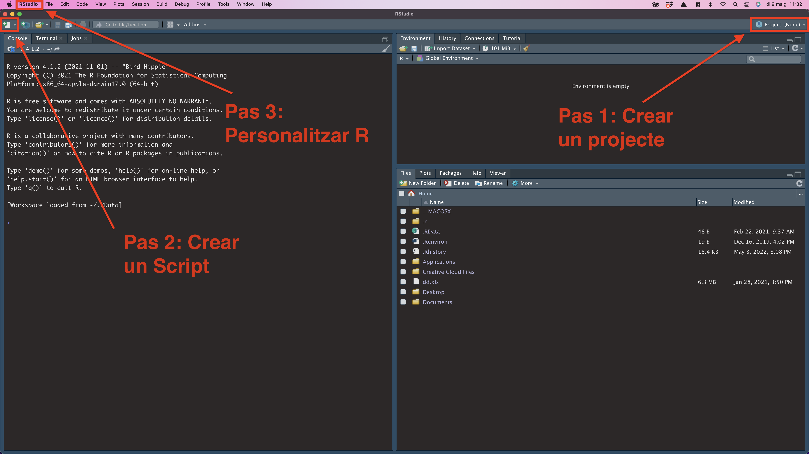{width=95%}


### Crear un projecte{#create-project}

Els projectes ens serveixen per ordenar el material amb què treballem: arxius, carpetes, scripts, etc. És molt recomanable que **obrim un projecte per cada activitat** que fem. Si en una assignatura tenim quatre activitats, l'ideal és obrir quatre projectes, un per cada activitat^[La raó principal per la qual s'insisteix en l'ús de projectes és que els projectes estan vinculats a una carpeta del nostre ordinador, que és coneguda per l'usuari. Així, si s'insisteix que tots els arxius que s'utilitzen han d'estar ubicats a la carpeta del projecte, es minimitzen els errors a l'hora de crear objectes a partit d'arxius.].

<div class="alert alert-info">
**Pas 1. Crea un projecte:** Prem el botó de la part superior dreta de la interfície d'R per crear un projecte. Segueix els passos que s'indiquen en la imatge següent:

{width=95%}
Arribaràs a la finestra **Create New Project**, on hauràs de posar el nom del projecte. A `Browse`, indica on es troba la carpeta de la teva assignatura (per exemple, Geografia, AnalisiDades, etc.) i posa un nom al projecte a `Directory name`, per exemple, PAC1 o Prova. Quan premis `Create Project`, R et crearà una carpeta amb el nom del projecte. D'aquesta carpeta en direm **directori de treball**.

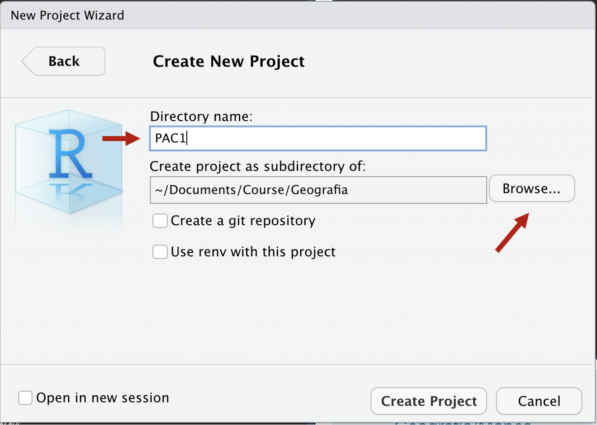{width=50%}

Cada projecte té associat un directori de treball, que correspon a una carpeta del teu ordinador. És preferible que no hi hagi accents, ni a les carpetes ni al nom del projecte. Per exemple, cal evitar `~/Documents/Adrià/AnàlisiDades`. És preferible `~/Documents/Adria/AnalisiDades`^[2.	Podem consultar la direcció del directori de treball si teclegem a la consola `getwd()`].
</div>

Un cop haguem creat el projecte, tornarem a la interfície principal d'RStudio. Fixem-nos que el botó superior dret que havíem clicat abans ja té el nom del projecte que hem acabat de crear. R ens mantindrà la sessió iniciada en aquest projecte fins que no indiquem el contrari.


### Crear un Script{#create-script}

Ja hem vist que la interfície està dividida en tres finestres, on tenim destacades les pestanyes Console, Files i Environment. Abans de res, crearem una quarta finestra: l'**_script_**.

<div class="alert alert-info">
**[Pas 2.]{#pas2} Crea i guarda un _script_:** A l'extrem superior esquerre de la interfície d'RStudio podràs obrir un desplegable amb diferents tipus de documents d'R. Seleccionarem el primer: **R Script**. A continuació guarda l'_script_ al teu directori de treball prement la icona del disquet a la part superior de l'_script_.^[Amb Windows, també el podem crear amb la drecera de teclat Ctrl+Shift+N. Amb macOs, Command+Shift+N.].

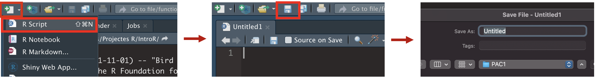{width=95%}

Pots guardar els scripts també amb Ctrl+S (Command+S en Mac).

</div>

Com veurem més endavant, l'_script_ ens servirà per registrar tots els passos que fem amb R. A vegades, en lloc de l'_script_ tindrem, com a quarta finestra, altres tipus de documents, com l'RMarkdown o Shiny Web App, però per ara només treballarem amb l'_script_. 


### Les quatre finestres{#four-windows}

Ara ja tenim les **quatre finestres** a la interfície d'RStudio, amb les quals treballarem habitualment. Anirem descobrint de mica en mica per a què serveix cada una. De moment, és suficient saber que:

-	L'_script_ és un document amb el qual podem anotar i transmetre les nostres indicacions a R.
-	La consola és l'instrument que utilitzem per interactuar amb R.
-	L'environment ens permet consultar tot el que R té emmagatzemat en memòria.
-	El files és la connexió d'R amb el sistema de carpetes del nostre ordinador. Normalment hi veurem el directori de treball del nostre projecte.


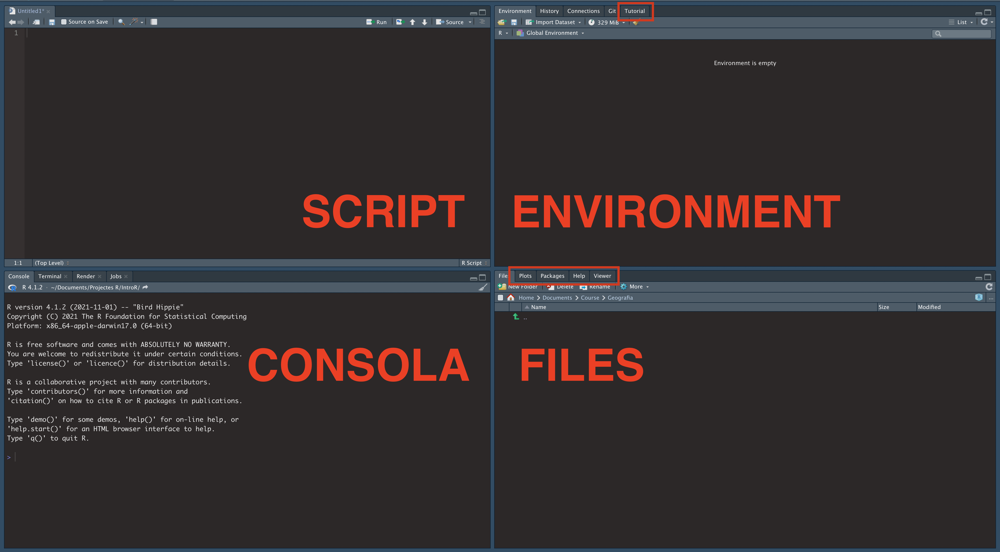{width=80%}

En aquestes finestres, hi ha algunes pestanyes (marcades amb requadre vermell a la imatge) que també utilitzarem. En veurem la utilitat més endavant. Per ara, només ens cal saber que existeixen:
-	La pestanya Plots (finestra Files) mostra els gràfics que generem amb R.
-	La pestanya Viewer (finestra Files) mostra els arxius HTML que generem amb R.
-	La pestanya Help (finestra Files) mostra els menús d'ajuda. La pestanya Packages (finestra Files) mostra els paquets que tenim instal·lats i carregats.
-	La pestanya Tutorial (finestra Environment) ens permet avançar l'aprenentatge del programa pel nostre compte amb tutorials àgils.
-	Les altres pestanyes no les farem servir fins a cursos més avançats.

<div class="alert alert-info">
**Pas 3. Personalitza el teu R:** Ens devem haver adonat que les captures de pantalla que hem vist anteriorment són amb fons negre, mentre que al nostre ordinador el fons ens apareix en blanc. Per personalitzar el nostre RStudio, anirem a Preferències a la part superior esquerra i seleccionarem Appearance a la finestra que ens aparegui.  

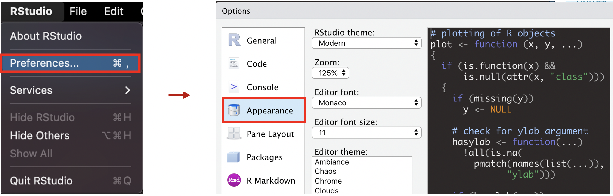{width=75%}

</div>


## Paquets{#packages}
RStudio és semblant al sistema operatiu Windows. Quan acabem de comprar-lo i l'obrim, està pràcticament buit. No té cap programa instal·lat. Si volem que Windows ens serveixi d'alguna cosa, haurem d'instal·lar-hi programes com Word, Excel i algun navegador. Amb R passa el mateix. Quan obrim R per primera vegada, està més aviat buit per dins de sèrie. Té incorporats alguns petits programes (a partir d'ara dels programes d'R en direm **paquets** o **llibreries**), però els programes més potents i que els usuaris utilitzen més sovint no venen instal·lats de sèrie. A Windows, el més normal és que haguem d'invertir uns quants diners per comprar i instal·lar programes. A R no cal comprar-los perquè tots són gratis. El que sí que haurem de fer serà instal·lar-los.


### Els paquets de sèrie

Hi ha uns paquets d'R que ja ens venen instal·lats de sèrie. Per veure quins són, una opció que tenim és anar a la pestanya Packages, que és a la finestra de Files. Tota la llista que hi apareix són els programes que tenim instal·lats. L'altra opció és fer la consulta a través de la consola. Provem de teclejar `installed.packages()` a la consola.

<div class="alert alert-info">
**[Pas 4]{#pas4}. Observa quins paquets tens instal·lats.** Ara interactuarem per primera vegada amb R a través de la consola. A la fletxa s'indica on podem escriure text.

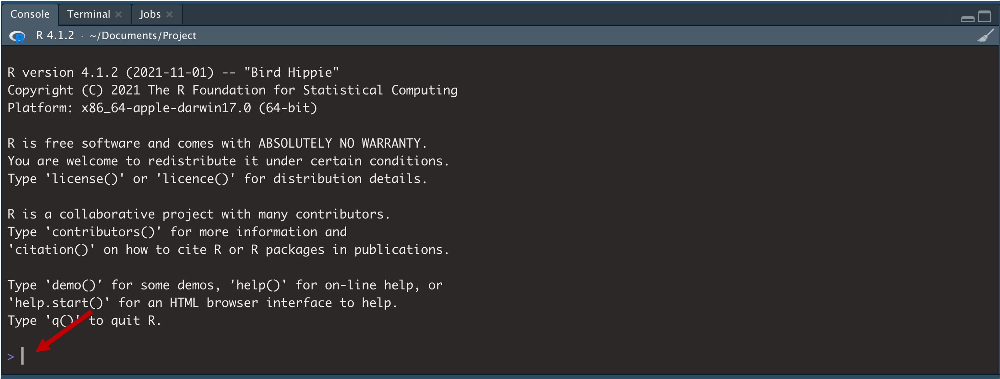{width=70%}

Provem de teclejar el següent:
```
installed.packages()
```
Prem **Enter** al teclat per executar l'acció.
</div>

Acabem de donar la nostra primera ordre a R. I ens ha contestat! R sempre utilitzarà la consola per respondre les nostres peticions. És per això que abans hem definit la consola com l'instrument que utilitzem per interactuar amb R. Una forma d'interacció que tenim a l'abast és fer servir R com una **calculadora**. Si li preguntem pel resultat d'algunes operacions matemàtiques, també ens respondrà a través de la consola. 

<div class="alert alert-info">
**Pas 5. Calcula:** Ara farem servir la consola com a calculadora. Introdueix, una per una, les operacions següents i prem Enter per executar l'acció.
```
2 + 2 + 2
10 / 5
(10 + 2) / 100
```
La consola ens hauria de retornar el resultat de cada operació. 
</div>


### Instal·lació de nous paquets{#new-packages}

Com que ja hem vist que no tenim gaires paquets instal·lats a R, a continuació demanarem a R que n'instal·li alguns de nous. Ho farem amb una funció molt semblant a l'anterior, `install.packages()`, que serveix per instal·lar paquets. 

<div class="alert alert-info">
**Pas 6. Instal·la els primers paquets:** A continuació instal·larem els paquets següents, que són els més utilitzats pels usuaris d'R: **dplyr** [@R-dplyr], **ggplot2** [@R-ggplot2], **tidyr** [@R-tidyr], **readxl** [@R-readxl] i **readr** [@R-readr]^[Una altra opció és instal·lar directament el paquet `tidyverse` [@R-tidyverse], que conté tots els paquets anteriors i alguns paquets més. No obstant, aquí preferim utilitzar els paquets individuals per dos motius: ens ajudarà a familiaritzar-nos amb cada paquet; no ens ocuparà tant espai ni tanta memòria RAM a l'ordinador.]. Més endavant coneixerem què fa cadascun. Tecleja o copia i enganxa el codi següent a la consola i prem Enter. 
```
install.packages(c("dplyr", "ggplot2", "tidyr", "readxl", "readr"))
```
Potser us demana si voleu instal·lar els paquets que necessiten compilació. Premeu Y. És possible que el procés tardi uns minuts a completar-se.
</div>

Cal seguir dues [**regles bàsiques**]{#reglespaquets} a l'hora d'instal·lar els paquets a R: 

-	Si hi instal·lem només **un** paquet, per exemple, un paquet que es digui `"paquet1"`, teclejarem `install.packages("paquet1")`.
-	Si, en canvi, instal·lem **dos o més** paquets, escriurem una `c()` a dins de la primera funció i separarem cada paquet per una coma, per exemple, `install.packages(c("paquet1", "paquet2"))`.

Si ara tornem a teclejar `installed.packages()` ([pas 4](#pas4)), veurem que tenim més paquets instal·lats a R^[Per una visualització més directa els paquets instal·lats, premeu `names(installed.packages()[,1])`.]. Per ara, només hem instal·lat cinc paquets nous, però és possible que més endavant necessitem algun paquet, que també haurem d'instal·lar seguint el mateix procediment. 

<div class="alert alert-danger">
**ERROR! ERROR! ERROR!** A vegades poden sorgir errors a l'hora d'instal·lar paquets. Aquestes són algunes de les possibles causes:

- No teniu connexió a internet.
- No heu posat `c()` o bé no heu separat cada paquet per una coma (consulta [regles bàsiques](#reglespaquets) per instal·lar paquets).
- No heu rodejat el nom de cada paquet `"entre cometes"`.
- Si no és cap d'aquestes causes, és possible que hagueu de consultar el Laboratori R (vegeu l'aula).
</div>


### Càrrega de paquets{#load-packages}

Continuant el símil amb Windows, quan instal·lem Microsoft Word no vol dir que el programa ja estigui en funcionament. Si volem que Word funcioni, òbviament haurem d'obrir el programa. Amb R passa el mateix. Tenir un paquet instal·lat no vol dir que estigui funcionant en R. A R, en lloc d'«obrir programes» diem **«carregar paquets»**. Si tornem a la finestra Packages (és una pestanya de la finestra Files), podem veure quins paquets tenim instal·lats i quins tenim instal·lats i carregats. 

- Tots els paquets que apareixen a la llista estan **instal·lats** (**1**) 
- Però només els que tenen un *check* també estan **carregats** (**2**). 

{width=70%}

Hi ha dues maneres més de mirar els paquets que tenim carregats: introduint la funció `search()` a la consola o bé clicant el botó Global Environment a la finestra Environment.

<div class="alert alert-info">
**Pas 7. Comprova els paquets instal·lats i carregats**: Escriu la funció `installed.packages()` a la consola i prem Enter per veure els paquets que ara tens instal·lats.

```
installed.packages() 
```
I ara escriu la funció `search()` per veure els paquets que tens carregats.
```
search() 
```
</div>

Com veiem, tenim instal·lats els paquets dplyr, ggplot2, tidyr, readxl i readr, però encara **no els tenim carregats**. I si no els tenim carregats, no els podrem fer servir. Per carregar paquets utilitzarem la funció `library()`.

<div class="alert alert-info">
**Pas 8. Carrega els paquets**: Carregarem, un per un, els paquets que hem instal·lat prèviament. En primer lloc, carregarem el paquet `dplyr`. No oblidis de prémer Enter.
```
library(dplyr)
```
Quan carreguis dplyr t'hauria d'aparèixer un missatge a la consola. A continuació, carrega el paquet `ggplot2`.
```
library(ggplot2)
```
Amb `ggplot2` la consola normalment no ens dona cap resposta. És normal. Segueix. En tercer lloc, carrega el paquet `tidyr`.
```
library(tidyr)
```
I finalment, carrega el paquet `readxl`.
```
library(readxl)
```
Pots comprovar que tens els paquets carregats amb `search()`.
</div>

Perquè un paquet es pugui utilitzar a R, doncs, haurà d'estar instal·lat i carregat. És molt important saber distingir entre instal·lar un paquet i carregar-lo:

-	Els paquets només **s'instal·len un cop** cada cert temps. Poden passar anys fins que no reinstal·lem un paquet. Normalment necessitarem tornar a instal·lar un paquet en un futur si apareix una nova versió i ens convé actualitzar-lo. Els paquets instal·lats ocupen espai a la memòria del nostre ordinador.
-	En canvi, els paquets s'han de **carregar cada vegada** que entrem a RStudio o obrim un nou projecte. Ho farem, un per un, amb la funció `library()`^[Hi ha altres maneres més ràpides d'instal·lar paquets. Si primer instal·lem i carreguem el paquet `pacman`, podem carregar tots els paquets amb la funció `pload()`. Per exemple: `p_load(dplyr, tidyr, ggplot2, readr, readxl)`. [Més informació.](https://www.rdocumentation.org/packages/pacman/versions/0.5.1)]. Els paquets carregats fan servir memòria RAM. Per això, cada vegada que sortim d'RStudio, els paquets es descarreguen per no alentir el funcionament del nostre ordinador.


### Obertura d'un paquet{#open-packages}

Obrir paquets sempre fa il·lusió. Per entendre com obrir els paquets que tenim instal·lats i carregats a R, podríem fer un símil amb els arxius comprimits .zip. Quan obrim un .zip, ens podem trobar tot tipus de documents. Els paquets són quelcom semblant i emmagatzemen objectes i funcions que ens seran molt útils per treballar amb R. 

Podem veure **el contingut d'un paquet** de dues maneres: 

1. A la finestra Environment, fem clic a Global Environment i seleccionem el nom del paquet.
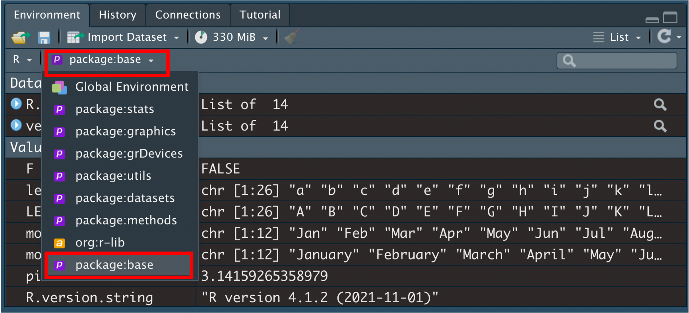{width=70%}

2. A la consola teclegem el nom del paquet seguit de `::`. Fixeu-vos que també ens apareix un petit panell d'ajuda per a cada element del paquet

{width=70%}


<div class="alert alert-info">
**Pas 9. Obra un paquet:** Provem d'obrir el paquet base, que és un dels que tenim instal·lats i carregats per defecte a R [@R-base]. En teclegem el nom a la consola seguit de dos `::` (COMPTE!: si copies i enganxes el codi, no se t'obrirà el desplegable. Has de teclejar el nom del paquet, que t'apareixerà quan posis els `::`).
```
base::
```
La llista que ens apareix conté tots els objectes i funcions del paquet, ordenats alfabèticament. Podem lliscar amunt i avall de la llista per veure'ls tots. Busca primer l'objecte `pi` i prem Enter.
```
base::pi
```
Veiem que ens apareix el número pi. Fes el mateix amb `letters` i `LETTERS`.
```
base::letters
base::LETTERS
```
No cal que posem sempre el nom del paquet davant de l'objecte o funció que volem utilitzar. Sempre que el paquet estigui carregat, també podrem visualitzar qualsevol objecte només introduint-ne el nom.
```
pi
letters
LETTERS
```
En aquest darrer cas, ens ha reproduït els objectes `pi`, `letters` i `LETTERS` perquè el paquet `base` **està carregat**. Si no tinguéssim el paquet carregat, no ens els reproduiria.
</div>


## L'objecte Star Wars{#starwars}

Ja hem avançat molt amb el domini d'R. Ordenem una mica el que hem après fins ara:

-	Per treballar amb R, necessitem **paquets**, que haurem de tenir instal·lats prèviament.
-	Els paquets **s'activen**, un per un, amb la funció `library()`.
-	Els paquets **contenen** principalment objectes i funcions.
-	Treballar amb R consisteix bàsicament a **aplicar funcions a objectes**.

Posem en pràctica totes aquestes idees amb l'exercici 1 següent, on veurem amb uns quants exemples com interactuen els objectes i funcions dels paquets d'R.

<div class="alert alert-success">
**Exercici 1: Starwars:** A R tenim diversos paquets de sèrie, que no cal que instal·lem ni carreguem. Per exemple, dins del paquet `base` tenim la funció `Sys.time()`, que ens permet saber quina hora és.
```
Sys.time()
```
Amb R, també ens ve de sèrie el paquet `datasets`. Teclejarem `datasets::` a la consola i, quan aparegui el desplegable, seleccionarem algun dels objectes que conté i premerem Enter. Recordeu que heu de teclejar el nom del paquet, no pas copiar i enganxar.
```
datasets::
```
Ara explorarem el paquet `dplyr`. Si tenim carregat el paquet, ens l'haurà de mostrar quan teclegem `dplyr::`. Baixarem pel desplegable fins al final de tot.
```
dplyr::
```
Hi ha moltíssimes coses a dins del paquet `dplyr`! Entre elles l'objecte `starwars`. Com que tenim el paquet carregat, només cal que teclegem el nom de l'objecte per visualitzar-lo.
```
starwars
```
Ens interessa saber més sobre `starwars`. Farem una ullada a totes les seves variables amb la funció `glimpse()`, que també forma part del paquet `dplyr`.
```
glimpse(starwars)
```
Sembla que aquest marc de dades conté les característiques de tots els personatges de *Star Wars*. Buscarem a internet i trobarem que al [web](https://dplyr.tidyverse.org/reference/starwars.html) de `dplyr` hi ha una breu descripció de les variables^[A la [pàgina principal](https://dplyr.tidyverse.org/index.html) del paquet `dplyr` trobareu més exemples de funcions que podem aplicar a l'objecte `starwars`.]. La primera variable, `name`, recull els noms dels personatges. Demanarem els noms únics amb `unique()` i els ordenarem alfabèticament amb `sort()`.
```
sort(unique(starwars$name))
```
La variable `height` conté l'alçada de cada personatge. Visualitzarem la distribució dels valors en un histograma amb la funció `hist()`.
```
hist(starwars$height)
```
Fixeu-vos que els gràfics s'obren directament a la pestanya Plots. Ara volem saber quants personatges de cada sexe hi ha, segons s'indica a la variable `sex`. Crearem una taula de freqüències amb `table()` i la visualitzarem amb la funció `barplot()`.
```
barplot(table(starwars$sex))
```
Finalment, volem comptar quants personatges hi ha comptabilitzats a cada planeta (`homeworld`) amb la funció `count()` del paquet `dplyr`.
```
count(starwars, homeworld)
```
R només ens mostra les deu primeres observacions de la llista a la consola. Visualitzarem l'objecte sencer amb `View()`.
```
View(count(starwars, homeworld))
```
Quan acabeu, **tanqueu la finestra** que s'acaba de crear. 
</div>

En aquest Exercici 1 hem simulat el procediment habitual que seguirem per treballar amb R, que consisteix a **aplicar funcions a objectes**. Això vol dir que necessitem dominar principalment dues coses:

-	**Crear objectes** com `starwars` que continguin dades sobre temes que ens interessin.
-	**Conèixer les funcions** com `glimpse()` que serveixin per modificar i analitzar els objectes que hem creat.

Abans, però, necessitem conèixer un element essencial que ens permetrà ordenar tot el nostre treball amb objectes i funcions: l'_script_.


<div class="alert alert-info">
**Pas 10. Fes una llista de funcions:** Per aprendre a utilitzar R més ràpidament, és bo que facis una llista de les funcions que vas aprenent. Apunta el nom de la funció, el paquet al qual correspon i una breu descripció de la seva utilitat.

```{r echo = FALSE, message = FALSE, warning = FALSE}
library(dplyr)
tribble(
  ~Funció, ~Paquet, ~Descripció,
  "installed.packages()",   "utils", "Mirem paquets instal·lats",
  "install.packages()",   "utils", "Instal·lem paquets",
  "search()",   "base", "Mirem paquets carregats",
  "library()",   "base", "Carreguem un paquet",
  "glimpse()",   "dplyr", "Observem variables") %>% 
  knitr::kable()
```

Per saber el paquet on es troba cada funció, només cal que introdueixis el nom de la funció a la consola. Al desplegable hi apareix el nom del paquet. Veuràs, per exemple, que la funció `hist()` correspon al paquet `graphics`.
</div>


## _Script_{#r-script}

Hem fet moltes coses fins ara. Si haguéssim de tornar-les a reproduir una per una, seria molt feixuc teclejar tot el codi de nou a la consola. Per sort, l'**_script_** ens evita haver de tornar a escriure totes les operacions, ja que ens serveix per anotar-hi les nostres indicacions, transmetre-les a R i reproduir-les sempre que vulguem en un moment. 


### Ordenació de l'_script_ {#order-script}

L'_script_ ens ajuda a ordenar els passos que anem fent amb R. El més adequat és ordenar-nos l'_script_ seguint una estructura que ens permeti entendre fàcilment el que estem fent (i que pugui entendre també qui llegeixi el nostre _script_). Aquí tenim dos exemples de _scripts_:

- [Estats amb vot similar a Rússia a l'Assemblea General de l'ONU](https://github.com/yello-data/FIIEI_UOC/blob/main/2022/russia_un.R)
- [Visualització de casos de Covid-19 a Espanya](https://github.com/yello-data/covid19/blob/master/covid19.R)

Una de les eines més útils que té l'_script_ és el **símbol #** (coixinet), que serveix tant per posar títols com per desactivar la resta d'informació que hi hagi a la dreta en la mateixa línia d'ordres. El coixinet també es pot utilitzar a la consola, però ens serà de molta més utilitat a l'_script_.

Per reproduir el codi que tinguem a l'_script_, haurem de situar el cursor a la línia de codi que vulguem reproduir i teclejar **Ctrl+Enter**.

<div class="alert alert-info">
**Pas 11. Utilitza l'_script_:** Per començar a utilitzar l'_script_, fes el següent:

-	Copia tot el codi següent a l'_script_ que havies obert anteriorment en el [Pas 2](#pas2).
-	Posa el cursor a la primera línia de l'_script_.
-	Prem repetidament Ctrl+Enter fins al final. Veuràs que R va llegint les indicacions de l'_script_. Reprodueix els resultats a la consola.

```
#Carreguem paquets
library(dplyr)
library(ggplot2)
library(tidyr)
library(readxl)
library(readr)

#Operacions matemàtiques
2 + 2 + 2
10 / 5
(10 + 2) / 100

#Proves amb paquet base
pi
letters #en minúscula
LETTERS #en majúscula

#Proves amb paquet dplyr
starwars
count(starwars, homeworld)
```
Aquest és un exemple de com podem organitzar-nos el codi a l'_script_. Fixem-nos en dos detalls:

-	R no reprodueix les línies de codi que comencen amb #.
-	R no llegeix el text que hi ha a la dreta del símbol `#`, a la línia de codi de `letters` i de `LETTERS`. 

Ara vegem què passaria si traguéssim el coixinet.
```
Proves amb paquet base
letters en minúscula
```
El programa ens retorna un **error**. R es pensa que `Proves amb paquet base` i `letters en minúscula` són els noms de diversos objectes, que òbviament no reconeix. 
</div>


### Regles bàsiques de l'_script_{#script-rules}

Hi ha quatre regles bàsiques que hem de seguir quan utilitzem l'_script_.

1. **Els espais:** R no llegeix els espais. Si els posem és perquè ens ajuden a entendre millor el codi. Per exemple, R llegirà igual `glimpse(starwars)` que `glimpse( starwars )`, o també
```
2+2
2   + 2
```
2. **Salts de línia:** Quan demanem a R que llegeixi una línia de codi, el programa ens saltarà automàticament a la següent si interpreta que el codi no està finalitzat. Per exemple:: 
```
count(starwars, 
      homeworld)
```
3. **Cursor:** Si el cursor està situat en qualsevol posició en la línia d'ordres de l'script, R llegirà tota la frase sencera (i això pot comportar que R també ens llegeixi línies superiors o inferiors). En el codi següent, tenim el cursor a la línia d'ordres número 5. Si premem Ctrl+Enter, anirà a buscar el principi del codi fins a la línia número 2. 
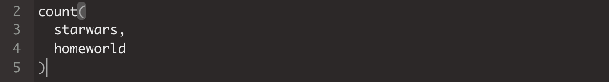{width=70%}

4. **Selecció:** Si en lloc de situar el cursor en una part del codi, seleccionem una part de la línia d'ordres il·luminant-la amb el cursor i premem Ctrl+Enter, R només ens llegirà aquesta part. En el codi següent, R interpreta que NOMÉS ha de llegir `starwars`.
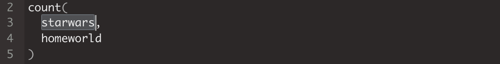{width=70%}


<div class="alert alert-danger">
**ERROR ERROR ERROR!**: Quan treballem amb R, és molt habitual que ens apareguin errors a la consola. El més important és **aprendre a llegir la consola** per saber de quin error es tracta. Les principals fonts d'error amb les quals ens trobarem corresponen a coses que ja hem vist a hores d'ara. Aquí tenim alguns dels errors més habituals:

1. Acabem un codi amb una **coma** (`starwars,`) i R interpreta per error que ha de llegir la línia següent:
```
Error: unexpected ',' in "starwars,"
```
2. Acabem un codi sense tancar un **parèntesi** (`glimpse(starwars`) i R interpreta per error que ha de llegir la línia següent:
```
En aquest cas apareixerà un símbol + a la consola
```
3. Acabem un codi sense tancar una **cometa** i R interpreta per error que ha de llegir la línia següent:
```
En aquest cas apareixerà un símbol + a la consola
```
4. No hem instal·lat el **paquet** `ddf` o bé no hem escrit correctament el nom del paquet que volíem utilitzar.
```
Error in library(ddf) : there is no package called ‘ddf'
```
5. No tenim carregat el **paquet** contenidor de la funció `frtr` o bé hem teclejat malament el nom de la funció.
```
Error in frtr(dd) : could not find function "frtr"
```
6. No hi ha **cap objecte** que es digui `letters en`.
```
Error: unexpected symbol in "letters en"
```
7. No hi ha **cap objecte** que es digui `strawars`.
```
Error: object 'strawars' not found
```
</div>


## Els objectes{#objects}

Ja hem vist anteriorment que a l'Environment hi ha emmagatzemats tots els objectes i funcions dels paquets que tenim carregats. Però també podem crear els nostres propis objectes i funcions. Ara mateix, si consultem a **Global Environment**, veurem que està buit.
 
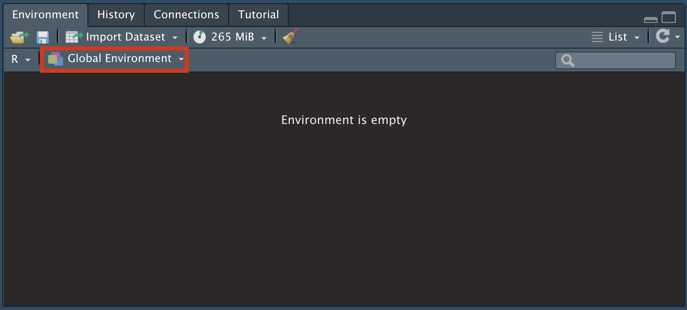{width=70%}

Ara crearem objectes (deixarem les funcions per a un curs més avançat).


### Crear objectes{#create-objects}

Els **objectes** són un conjunt de dades que s'emmagatzemen a R amb un nom determinat. Per crear un objecte propi i emmagatzemar-lo al Global Environment, necessitarem el símbol `<-`^[Amb Windows, també el podem crear amb la drecera de teclat Alt+-. Amb Mac, Option+-.]. A l'esquerra del símbol hi posarem el nom que adoptarà l'objecte i a la dreta hi posarem el contingut.

<div class="alert alert-info">
**Pas 12. Crea objectes**: A continuació crearem els objectes següents:
```
V <- 6
suma <- 2 + 2
Suma <- 3 + 4 + 6 + 6
V <- 25 / 5
```
Comprova que aquests objectes s'han creat en el Global Environment:

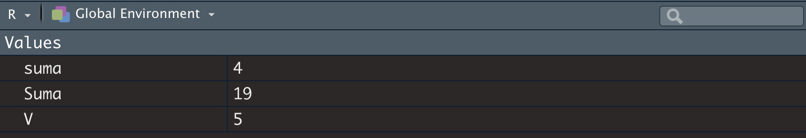{width=70%}
</div>

En la creació d'objectes hi ha algunes **regles bàsiques** que cal tenir en compte:

- R distingeix entre majúscules (`Suma`) i minúscules (`suma`).
-	Si guardem una operació (`3 + 4 + 6 + 6`) en un objecte, R ens guardarà només el resultat de l'operació (`19`).
-	Si guardem un objecte amb el nom d'un objecte ja creat (`V`), R sobreescriurà l'antic objecte. Així, en la segona vegada que hem creat un objecte amb nom `V`, R ha sobreescrit el nou resultat.


### Consulta, reproducció i eliminació d'objectes

Amb els objectes podem fer quatre accions principals:

-	**Consultar** els objectes que hem creat teclejant `ls()`.
-	**Reproduir** el contingut d'un objecte teclejant-ne el nom seguit de Ctrl+Enter.
-	**Eliminar** els objectes del Global Environment utilitzant la funció `rm()`. Per exemple, `rm(Suma, V)` eliminarà els objectes `Suma` i `V` del Global Environment.
-	**Eliminar tots** els objectes utilitzant `rm(list = ls())`.


<div class="alert alert-info">
**Pas 13. Reprodueix objectes**: Podem reproduir el contingut dels objectes que acabem de crear si situem el cursor a la línia de codi de l'_script_ que conté el nom de l'objecte que volem reproduir i premem Ctrl+Enter.
```
suma
Suma
V
```
Recordem que, com hem vist anteriorment, també podem reproduir un objecte si el seleccionem a l'_script_ i premem Ctrl+Enter.

{width=70%}

</div>


## Importar arxius{#import-files}

Fins ara hem creat objectes de poc interès substantiu sobre la temàtica que estem estudiant. Encara que pugui ser apassionant viatjar per l'univers de *Star Wars*, la gràcia de crear objectes és, com hem esmentat anteriorment, aconseguir que continguin dades sobre temes que tinguin relació directa amb la nostra disciplina d'estudi. Això es fa mitjançant la importació d'arxius. El procediment habitual amb R serà el següent:

1. **Convertirem una base de dades en un objecte d'R.** Per exemple, una base de dades de partits polítics, o de grups terroristes, o de bombardejos al Iemen.
2. **Treballarem l'objecte amb funcions.** Les funcions ens permetran transformar les dades per tal que responguin les nostres preguntes.

Les dades que ens interessen se solen trobar en arxius que tenen formats que probablement ens són familiars, com `.xlsx`, `.csv` o `.dta`. Per transformar aquestes dades en objecte d'R, les **funcions d'importació** tenen noms bastant intuïtius. Per exemple:

-	Si volem llegir un arxiu `csv`, la funció serà habitualment `read_csv()`, que és al paquet `readr`.
-	Si volem llegir un arxiu `xlsx`, la funció serà habitualment `read_xlsx()`, que és al paquet `readxl`.


### Importar des d'una web{#import-files-web}

En algunes ocasions, importar un arxiu des d'una web pot ser la mar de senzill. Només ens caldrà conèixer l'adreça web on és, examinar de quin tipus d'arxiu es tracta, donar un nom a l'objecte i aplicar la funció que volem utilitzar. Per exemple:

- Web: `https://www.chesdata.eu/s/Candidate_Ukraine_2014.csv`.
- Tipus d'arxiu: Veiem que és un arxiu `csv`.
- Nom d'objecte: `ches`.
- Funció: `read_csv()`.


<div class="alert alert-info">
**Pas 14. Importar des de pàgina web**: A continuació importarem un arxiu que és a la pàgina web de la [Chapel Hill Expert Survey (CHES)](https://www.chesdata.eu/). La funció que necessitem pertany al paquet `readr`, que haurem de tenir carregat si volem que ens funcioni:
```
ches <- read_csv("https://www.chesdata.eu/s/Candidate_Ukraine_2014.csv")
```
És important remarcar que el nom de l'ubicació d'internet ha d'anar entre cometes. Un cop hem creat l'objecte `ches`, ja li podem aplicar algunes funcions com les que hem vist anteriorment.
```
ches
glimpse(ches)
unique(ches$party_name)
hist(ches$lrgen)
plot(ches$lrgen, ches$galtan)
```
</div>

Si el codi anterior ens ha funcionat és perquè tenim carregat el paquet `readr`, que conté la funció `read_csv()`. De la mateixa manera, si volem importar a R un arxiu d'Excel, necessitarem les funcions `read_xlsx()` o `read_xls()` del paquet readxl, que també haurem de tenir carregat. Aquestes i altres maneres d'importar arxius les resumim a la següent Taula \@ref(tab:import)^[Com observem a la taula, podem distingir dos tipus de funcions csv. La funció `read_csv()` importa els arxius que estan codificats en format americà, on la coma separa els valors i el punt indica els decimals, mentre que la funció `read_csv2()` importa els arxius codificats en format europeu, on el punt i coma és el separador i la coma indica els decimals.].


```{r import, echo = FALSE, message = FALSE, warning = FALSE}
library(dplyr)
tribble(
  ~`Tipus d'arxiu`, ~Paquet, ~Funcions,
  "csv",   "readr", "read_csv() o read_csv2()",
  "xls",   "readxl", "read_xls()",
  "xlsx",   "readxl", "read_xlsx()",
  "dta",   "foreign", "read.dta()",
  "dta",   "haven", "read_dta()",
  "sav", "haven", "read_sav()",
  "spss", "haven", "read_spss()") %>% 
  knitr::kable(caption = "Tipus de funcions per importar arxius")
```


### Importació des del directori de treball{#import-files-wd}

El més habitual, però, és que no sigui tan fàcil importar les dades directament d'internet. Normalment, el que haurem de fer serà entrar a la pàgina web on són les dades, descarregar l'arxiu al nostre ordinador, situar-lo al nostre directori de treball i importar-lo a R^[Hi ha funcions com `download.file()` que ens permeten automatitzar la descàrrega d'arxius des d'internet. No obstant, és una funció que genera errors en alguns ordinadors, de manera que no l'aprendrem fins més endavant.].

Un aquest cas, l'únic que haurem de fer és assegurar-nos que tinguem l'arxiu en el **directori de treball** i posar el seu nom, entre cometes, a la funció d'importació. 
```
ches <- read_csv("Candidate_Ukraine_2014.csv")`
```
En el següent exercici descarregarem un arxiu d'Excel, el situarem al nostre directori de treball i el convertirem en un objecte d'R.


<div class="alert alert-success">
**Exercici 2. Importa els SDG**: Volem treballar amb els Sustainable Development Goals (SDG), que es troben a la web de [Sustainable Development Report](https://www.sdgindex.org/reports/sustainable-development-report-2021/). A dins de la web, les dades són a la part dreta de la pantalla.

{width=70%}

Descarregarem l'arxiu i ens assegurarem que estigui ubicat al nostre directori de treball.

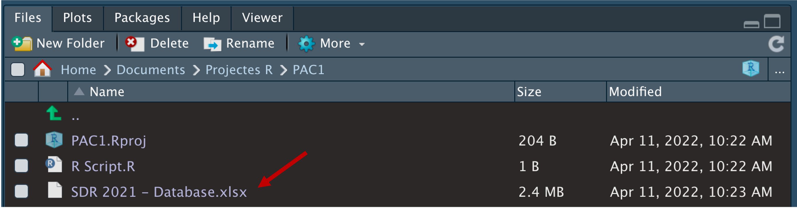{width=70%}

També podem consultar el contingut del nostre directori de treball amb la funció següent.
```
dir()
```

Finalment, com que tenim carregat el paquet `readxl`, transformarem l'arxiu d'Excel en un objecte d'R mitjançant la funció següent. Fixeu-vos que hem introduït l'argument `sheet = 4` a la funció. Aquests arguments ens serveixen per donar indicacions més detallades a les funcions. En aquest cas, estem precisant que les dades que ens interessen són a la quarta pestanya de l'arxiu d'Excel.

```
sdg <- read_xlsx("SDR 2021 - Database.xlsx", sheet = 4)
```
Un cop hem creat l'objecte `sdg`, ja li podem aplicar algunes funcions.
```
sdg
glimpse(sdg)
table(sdg$`Regions used for the SDG Index & Dashboard`)
hist(sdg$`Press Freedom Index (best 0-100 worst)`)
```
</div>

<div class="alert alert-info">
**Pas 15. Ordena el directori de treball:** En alguns projectes, és possible que haguem de posar molts documents al nostre directori de treball. Una forma útil d'ordenar els arxius és utilitzar el sistema de carpetes habitual.

1. A la finestra Files, crearem una carpeta que es digui `Datasets`.   

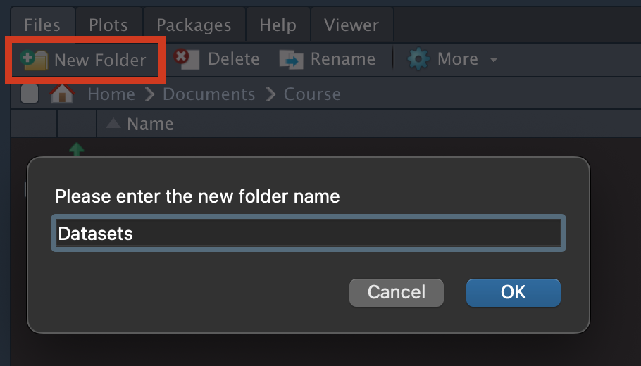{width=40%}

2. Posarem l'arxiu `SDR 2021 - Database.xlsx` a dins la carpeta `Datasets`.

3. Inclourem `Datasets/` abans del nom de l'arxiu en la funció d'importació.

```
sdg <- read_xlsx("Datasets/SDR 2021 - Database.xlsx", sheet = 4)
```
</div>


## Resum{#summary}

**1. Les quatre finestres**
És important conèixer perquè serveixen les quatre finestres d'R. Bàsicament, la seva utilitat és la següent:

- R ens parla des de la **consola**.
- A l'_script_ ens organitzem el treball.
- A l'**Environment** veiem els objectes i funcions disponibles.
- A **Files** veiem el directori de treball.

**2. Crear un projecte**  
Encara que no és indispensable, és molt recomanable crear sempre un projecte quan es vulgui iniciar una activitat nova.

**3. Instal·lar paquets**  
Quan comencem un nou exercici, projecte o assignatura, ens hem de fixar bé en els paquets que necessitarem. És possible que ja tinguem instal·lats tots els paquets que necessitem. Però també és possible que haguem d'instal·lar nous paquets. Per exemple, potser ens adonem que no tenim els paquets `countrycode` i `stringr`.
```
install.packages(c("countrycode", "stringr"))
```

**3. Carregar paquets**  
Cada vegada que entrem a R o obrim un nou projecte, hem de tenir en compte que hem de carregar els paquets que volem utilitzar.
```
library(readxl)
library(dplyr)
library(countrycode)
library(stringr)
```

**4. Crear objectes**  
Crearem objectes amb el símbol `<-`.
```
sdg <- read_xlsx("Datasets/SDR 2021 - Database.xlsx", sheet = 4)
```

**5. Crear el nostre _script_**  
Hem de guardar tots els passos que anem fent a l'_script_.
<div class="alert alert-warning">

```
# Carreguem els paquets
library(readxl)
library(dplyr)
library(countrycode)
library(stringr)

# Importem arxiu SDG
sdg <- read_xlsx("Datasets/SDR 2021 - Database.xlsx", sheet = 4)

# Mirem l'arxiu
head(sdg)
glimpse(sdg)
```
</div>


<div class="alert alert-success">
**PRACTICA:** Per practicar el què has après en aquest mòdul, entra a la web següent i fes els exercicis que es proposen.

- [Exercicis Guia d'RStudio](https://www.jordimas.cat/courses/dataanalysis_en/exercises/data_analysis_en_exercises_guide/)

</div>


